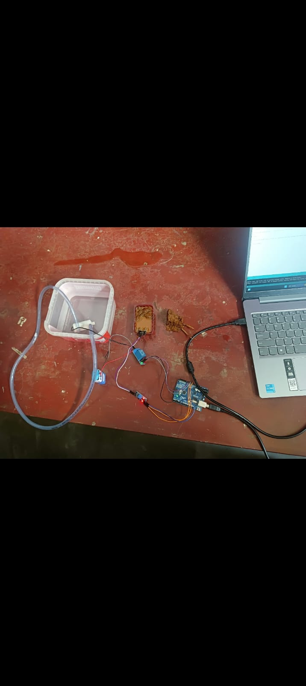
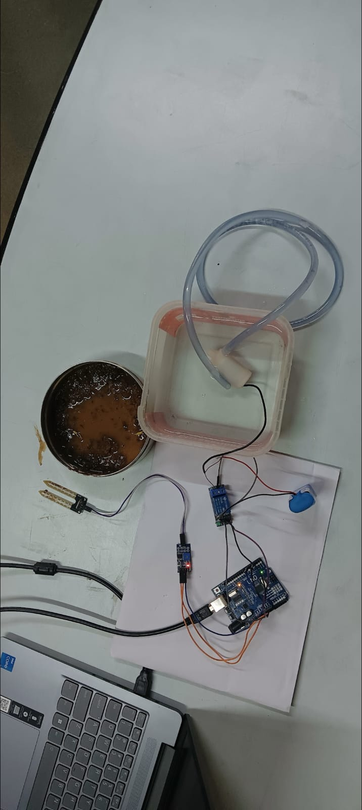

# Automated Plant Watering System 🌱💧

A simple Arduino-based hobby project that automatically waters a plant when the soil becomes dry.

## Project Overview

This project uses a soil moisture sensor to monitor the moisture level of soil. An Arduino Uno reads the sensor value and controls a water pump through a relay module.

When the soil becomes sufficiently dry:

1. The soil moisture sensor detects the dry condition.
2. Arduino reads the analog sensor value.
3. Arduino activates the relay.
4. The relay switches the water pump ON.
5. Water is delivered through tubing to the plant.
6. The pump is switched OFF after a short watering cycle.

## Hardware Used

- Arduino Uno
- Soil moisture sensor / soil moisture sensor module
- 1-channel relay module
- Small DC water pump
- Water container
- Flexible water tubing
- Connecting jumper wires
- USB cable / Arduino power source

## Photos

### Prototype 1


### Prototype 2


## Basic Block Diagram

```text
Soil
  ↓
Soil Moisture Sensor
  ↓
Arduino Uno
  ↓
Relay Module
  ↓
Water Pump
  ↓
Water Tube
  ↓
Plant
```

## Reconstructed Wiring

The original wiring documentation was lost, so the following is a reconstructed starting point based on the hardware shown in the project photographs.

| Component | Arduino / Connection |
|---|---|
| Soil moisture sensor AO | A0 |
| Soil moisture sensor VCC | 5V |
| Soil moisture sensor GND | GND |
| Relay IN | D7 |
| Relay VCC | 5V |
| Relay GND | GND |
| Pump | Connected through relay contacts and a suitable external supply |

**Important:** Do not power a DC pump directly from an Arduino GPIO pin. Use the relay and an appropriate power supply for the pump. Check the relay module and pump ratings before connecting them.

## Software

- Arduino IDE
- Arduino C/C++

## How the Logic Works

The Arduino continuously reads the analog moisture value.

A dry-soil threshold is used to decide when watering should start. A second, lower threshold is used to decide when the soil is wet enough. This creates simple hysteresis and helps prevent rapid ON/OFF switching near a single threshold.

The reconstructed code is in:

`src/automated_watering_system.ino`

## Calibration

Because the original calibration values were lost, the threshold in the code should be adjusted for the actual sensor.

1. Upload the program.
2. Open Arduino IDE Serial Monitor at **9600 baud**.
3. Observe the reading with the sensor in dry soil.
4. Observe the reading with the sensor in wet soil.
5. Set `DRY_THRESHOLD` and `WET_THRESHOLD` between the measured ranges.
6. Test the relay with the pump disconnected before the final water test.

## Repository Note

The original source code and documentation for this hobby prototype were deleted. This GitHub repository preserves the project using the available hardware photographs and a reconstructed Arduino implementation.

The reconstructed code is intended as a functional starting point, not as a claim that it is the exact original source code.

## Future Improvements

- Add an LCD/OLED display for moisture percentage.
- Add adjustable thresholds using buttons or a potentiometer.
- Use a capacitive soil moisture sensor for improved durability.
- Add a manual watering button.
- Add a water-level sensor to detect an empty tank.
- Add ESP8266/ESP32 connectivity for remote monitoring.
- Add a moisture history dashboard.
